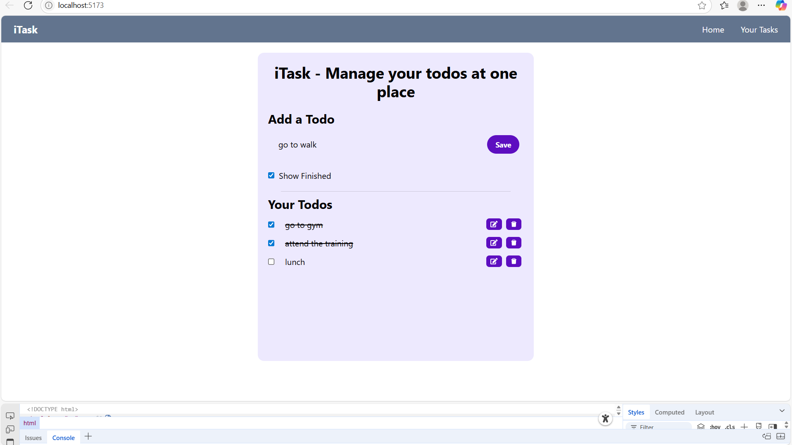

# 📋 iTask – Your Personal To-Do List App

iTask is a simple and elegant **React-based To-Do List** app built with **Vite** and styled using **Tailwind CSS**. It allows users to create, manage, edit, and delete todos, with support for marking tasks as completed and persisting them in **localStorage**.



---

## 🚀 Features

- ✅ Add, edit, and delete todos
- 📌 Mark tasks as completed or unfinished
- 💾 Data persistence via localStorage
- 🧼 Minimal UI with responsive design
- 🎨 Styled with Tailwind CSS
- 🔍 Toggle visibility for completed tasks

---


## 🛠️ Tech Stack

- [React](https://reactjs.org/)
- [Vite](https://vitejs.dev/)
- [Tailwind CSS](https://tailwindcss.com/)
- [uuid](https://www.npmjs.com/package/uuid) – For unique todo IDs
- [React Icons](https://react-icons.github.io/react-icons/) – For edit/delete icons

---

## 📦 Installation

Clone the repository and install dependencies:

```bash
git clone https://github.com/your-username/iTask.git
cd iTask
npm install


# React + Vite

This template provides a minimal setup to get React working in Vite with HMR and some ESLint rules.

Currently, two official plugins are available:

- [@vitejs/plugin-react](https://github.com/vitejs/vite-plugin-react/blob/main/packages/plugin-react/README.md) uses [Babel](https://babeljs.io/) for Fast Refresh
- [@vitejs/plugin-react-swc](https://github.com/vitejs/vite-plugin-react-swc) uses [SWC](https://swc.rs/) for Fast Refresh
